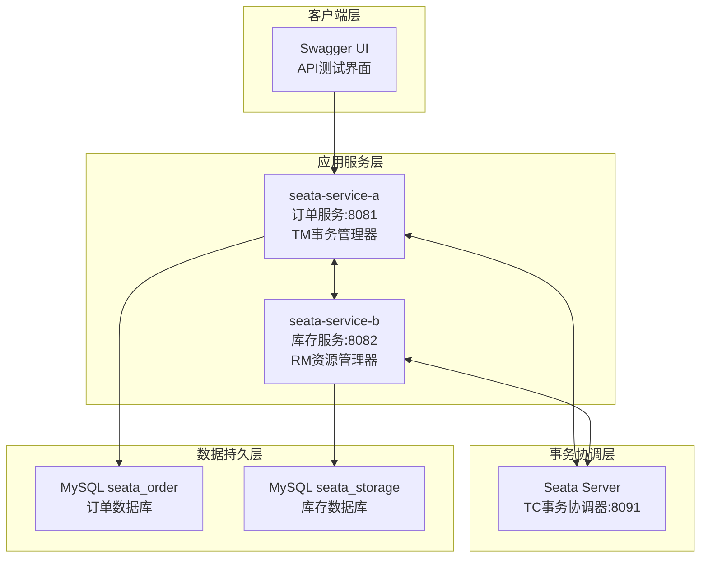
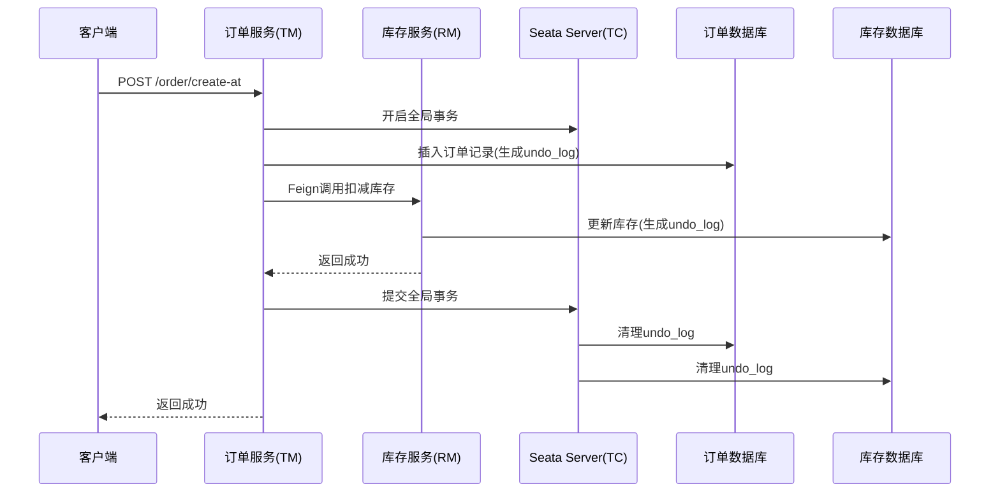
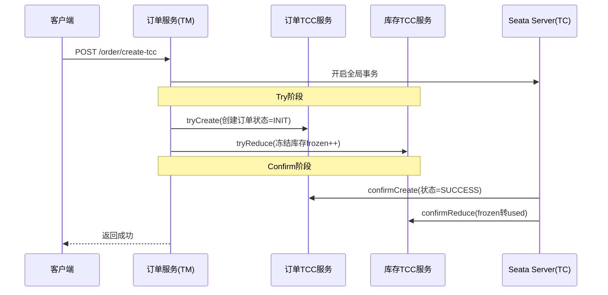
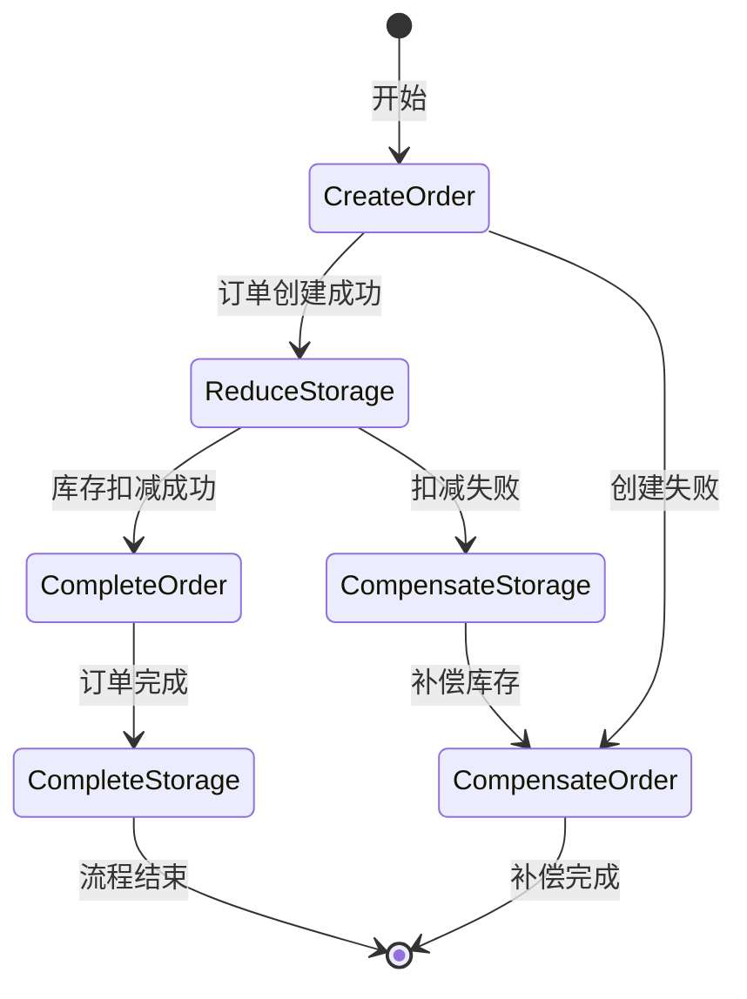
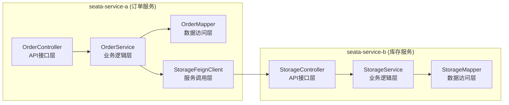
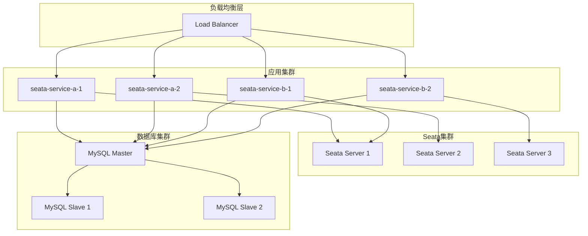

## Seata分布式事务演示项目架构总结

### 1. 项目整体架构设计

这是一个基于Seata框架的分布式事务技术验证项目，采用微服务架构设计，通过经典的"订单-库存"业务场景验证三种分布式事务模式（AT、TCC、Saga）的实现。



### 2. 技术栈和核心组件

| 组件类别 | 技术选型 | 版本 | 作用 |
|---------|---------|------|------|
| **基础框架** | Spring Boot | 2.3.12.RELEASE | 应用框架 |
| **微服务** | Spring Cloud | Hoxton.SR12 | 微服务生态 |
| **分布式事务** | Spring Cloud Alibaba Seata | 2.2.8.RELEASE | 分布式事务管理 |
| **Seata核心** | Seata | 1.4.2 | 分布式事务引擎 |
| **ORM框架** | MyBatis Plus | 3.4.3 | 数据访问层 |
| **服务调用** | OpenFeign | - | 服务间通信 |
| **数据库** | MySQL | 5.7+ | 数据持久化 |
| **连接池** | Druid | 1.2.6 | 数据库连接池 |
| **API文档** | Swagger | 3.0.0 | 接口文档生成 |
| **运行环境** | Java | 11 | JVM运行时 |

### 3. 三种事务模式的实现架构

#### 3.1 AT模式架构


**核心特点**：
- **无业务侵入**：只需`@GlobalTransactional`注解
- **自动回滚**：基于`undo_log`表实现前后镜像回滚
- **数据表**：`t_order`、`t_storage`、`undo_log`

#### 3.2 TCC模式架构


**核心特点**：
- **三阶段控制**：`@LocalTCC`和`@TwoPhaseBusinessAction`
- **资源预留**：Try阶段冻结资源，Confirm阶段确认使用
- **数据表**：`t_order_tcc`、`t_storage_tcc`（增加frozen字段）

#### 3.3 Saga模式架构


**核心特点**：
- **状态机编排**：通过`create-order-saga.json`定义业务流程
- **正向补偿**：每个正向操作对应补偿操作
- **数据表**：`t_order_saga`、`t_storage_saga`（增加status字段）

### 4. 服务间通信和数据流

#### 4.1 服务架构


#### 4.2 数据流转
- **XID传播**：全局事务ID通过HTTP Header在服务间传播
- **Feign集成**：使用`StorageFeignClient`实现服务调用
- **超时配置**：`feign.client.config.default.read-timeout: 30000`

### 5. 架构设计亮点和最佳实践

#### 5.1 分层架构设计
```
Controller层（API接口）
    ↓
Service层（业务逻辑、事务管理）
    ↓
Mapper层（数据访问）
    ↓
Database（数据持久化）
```

#### 5.2 职责分离
- **订单服务（seata-service-a）**：TM事务管理器，全局事务发起方
- **库存服务（seata-service-b）**：RM资源管理器，分支事务参与方
- **Seata Server**：TC事务协调器，全局事务协调

#### 5.3 配置管理
- **统一配置**：`application.yml`中集中管理Seata配置
- **事务分组**：`tx-service-group: my_test_tx_group`
- **数据源代理**：`data-source-proxy-mode: AT`

#### 5.4 异常处理
- **统一响应格式**：`Result`类封装返回结果
- **业务异常**：`BusinessException`处理业务异常
- **全局异常处理**：Controller层统一异常捕获

### 6. 架构优化建议

#### 6.1 高可用优化


#### 6.2 性能优化建议
1. **连接池优化**：调整Druid连接池参数
2. **批量操作**：对于大量数据操作使用批量处理
3. **异步处理**：非关键路径使用异步处理
4. **缓存策略**：引入Redis缓存热点数据

#### 6.3 监控告警
1. **APM监控**：集成SkyWalking或Zipkin
2. **业务监控**：监控事务成功率、回滚率
3. **性能监控**：监控接口响应时间、数据库连接数

#### 6.4 生产化改进
1. **注册中心**：集成Nacos替代file模式
2. **配置中心**：使用Nacos Config管理配置
3. **服务网格**：考虑引入Istio进行服务治理
4. **容器化部署**：使用Docker + Kubernetes部署